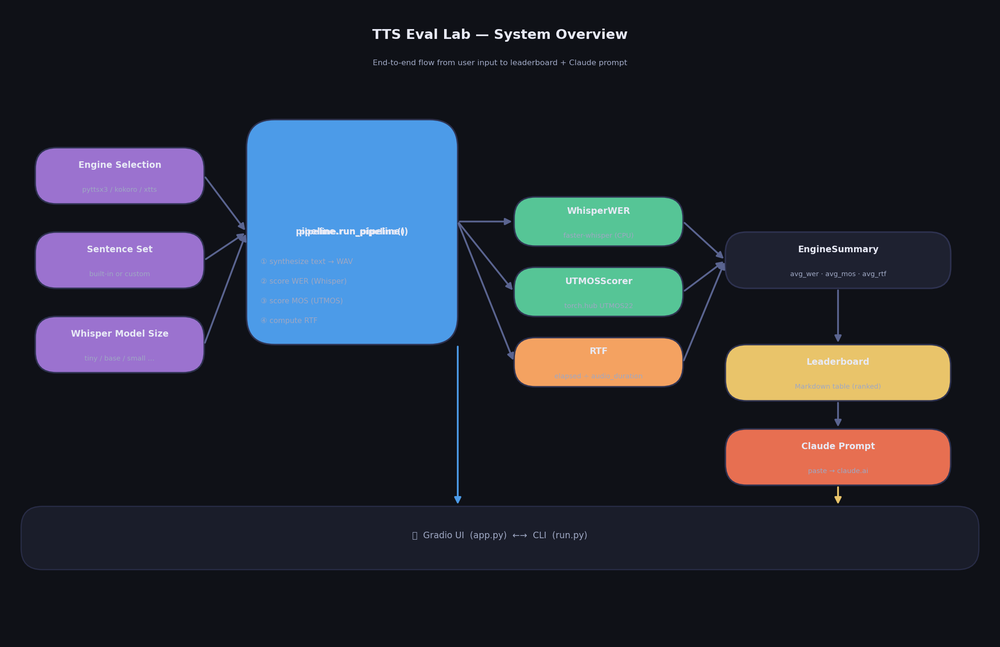
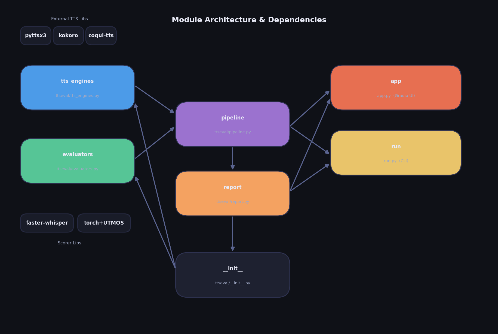
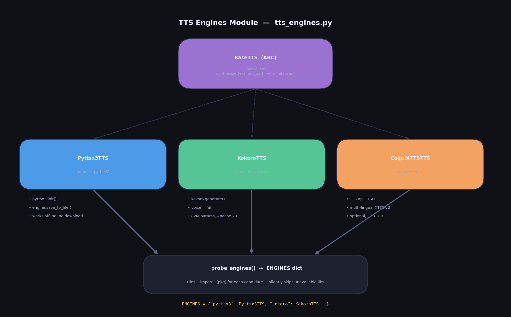
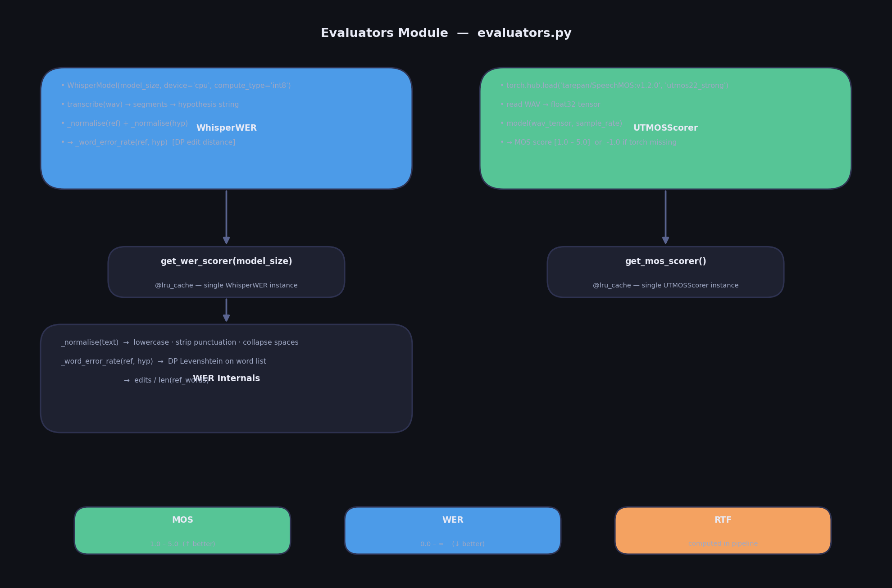
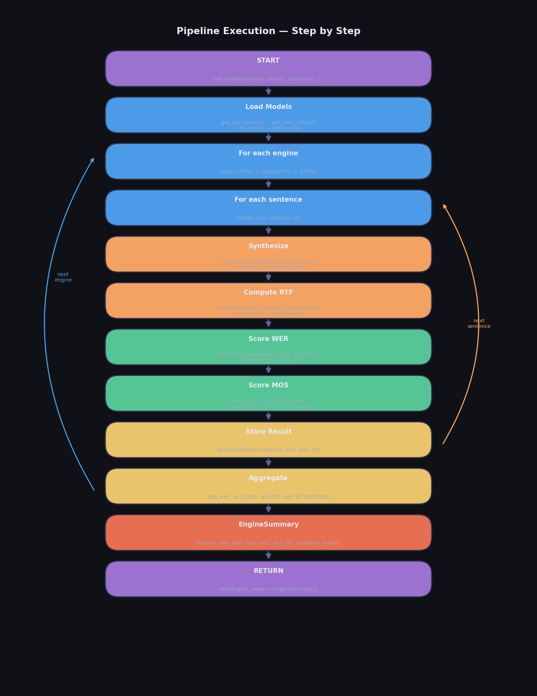
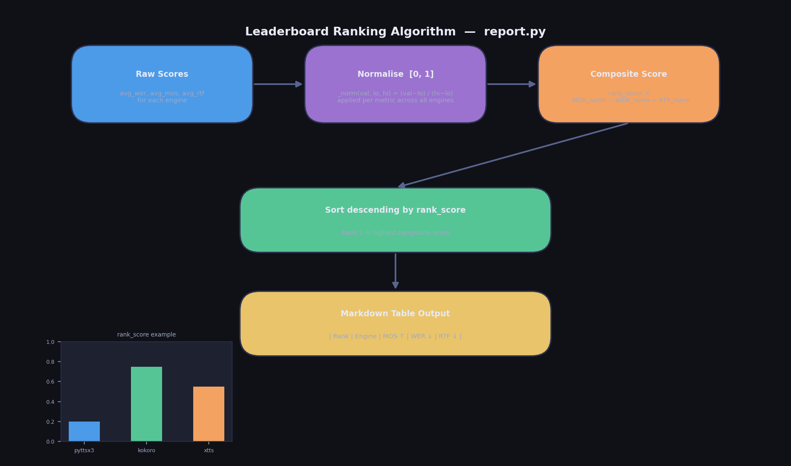
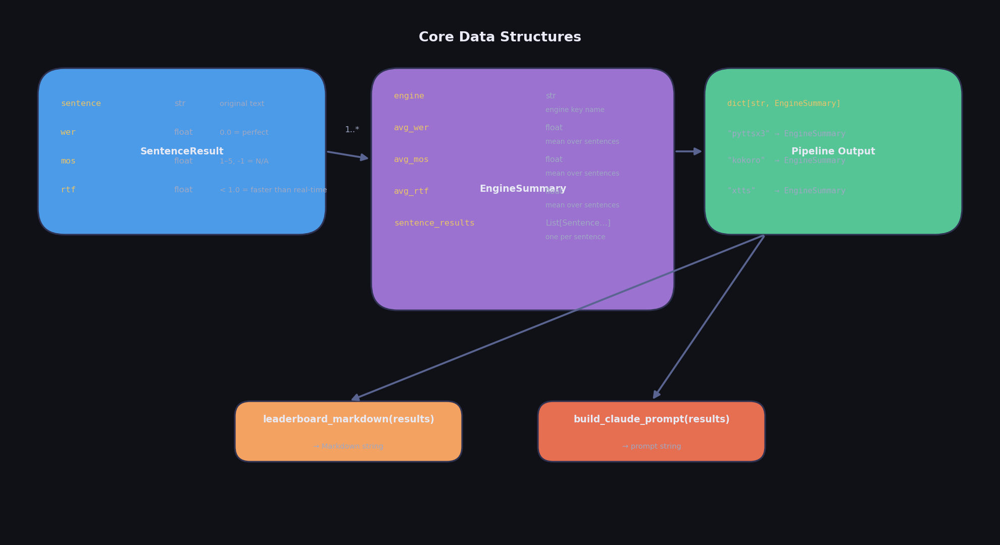
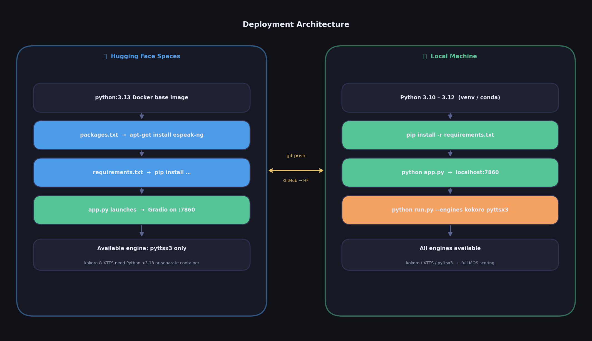

# TTS Eval Lab — Architecture & Developer Documentation

A free, fully-local pipeline that benchmarks text-to-speech engines on three objective metrics and generates a leaderboard plus a ready-to-paste qualitative analysis prompt for [claude.ai](https://claude.ai). No paid APIs. No GPU required.

---

## Table of Contents

1. [What Was Built](#1-what-was-built)
2. [System Overview](#2-system-overview)
3. [Module Architecture](#3-module-architecture)
4. [Module Deep-Dives](#4-module-deep-dives)
   - [tts_engines.py](#41-tts_enginespy)
   - [evaluators.py](#42-evaluatorspy)
   - [pipeline.py](#43-pipelinepy)
   - [report.py](#44-reportpy)
   - [app.py](#45-apppy)
   - [run.py](#46-runpy)
5. [Data Structures](#5-data-structures)
6. [Metrics Explained](#6-metrics-explained)
7. [Ranking Algorithm](#7-ranking-algorithm)
8. [Deployment Architecture](#8-deployment-architecture)
9. [How to Add a New Engine](#9-how-to-add-a-new-engine)
10. [Known Limitations](#10-known-limitations)

---

## 1. What Was Built

TTS Eval Lab is a **benchmarking pipeline** that:

1. Takes a list of TTS engines and test sentences as input
2. Synthesizes each sentence with each engine, producing WAV files
3. Scores each WAV on three objective metrics (WER, MOS, RTF)
4. Aggregates scores per engine into an `EngineSummary`
5. Renders a ranked Markdown leaderboard
6. Emits a structured prompt you paste into [claude.ai](https://claude.ai) for qualitative analysis

The pipeline runs entirely locally. The "Claude step" is intentionally manual — no API key needed.

---

## 2. System Overview



**Inputs**
- **Engine Selection** — which TTS engines to benchmark (`pyttsx3`, `kokoro`, `xtts`)
- **Sentence Set** — built-in 8-sentence set, or a custom list
- **Whisper Model Size** — controls accuracy vs. speed of WER scoring (`tiny` → `large-v2`)

**Processing**
`pipeline.run_pipeline()` is the single entry point. It orchestrates synthesis + scoring in a nested loop (engine × sentence), and returns a dict of `EngineSummary` objects.

**Outputs**
- **Leaderboard** — ranked Markdown table
- **Claude Prompt** — structured text for qualitative analysis

Both outputs are surfaced through the Gradio UI (`app.py`) and the CLI (`run.py`).

---

## 3. Module Architecture



```
ttseval/
├── __init__.py        Re-exports the public API
├── tts_engines.py     TTS synthesis wrappers + ENGINES registry
├── evaluators.py      WER (WhisperWER) + MOS (UTMOSScorer) scorers
├── pipeline.py        Orchestration loop, EngineSummary dataclasses
└── report.py          Leaderboard Markdown + Claude prompt builder

app.py                 Gradio web UI (HF Spaces entry point)
run.py                 CLI entry point (argparse)
```

**Dependency direction** (no cycles):

```
tts_engines  ──┐
               ├──▶  pipeline  ──▶  report  ──▶  app.py / run.py
evaluators   ──┘
```

`__init__.py` re-exports from `tts_engines`, `pipeline`, and `report` so callers can write `from ttseval import run_pipeline` instead of the full module path.

---

## 4. Module Deep-Dives

### 4.1 tts_engines.py



**Purpose:** Wraps three different TTS libraries behind a single `synthesize()` interface.

**Key design decisions:**

- `BaseTTS` is an abstract base class (ABC). Every engine **must** implement `synthesize(text, out_path) → (sample_rate, elapsed_seconds)` and write a WAV file to `out_path`.
- Heavy dependencies (`pyttsx3`, `kokoro`, `TTS`) are **lazy-imported inside `__init__`**, never at module top level. This means importing `ttseval` is cheap even if no TTS library is installed.
- `_probe_engines()` runs at module load time and builds the `ENGINES` dict by attempting `__import__` for each candidate package. Missing libraries are silently skipped — the engine simply won't appear in the dict.

**Engines:**

| Engine | Class | Library | Notes |
|--------|-------|---------|-------|
| `pyttsx3` | `Pyttsx3TTS` | `pyttsx3` | Pure offline, uses OS TTS (espeak on Linux). No model download. |
| `kokoro` | `KokoroTTS` | `kokoro` | 82M parameter neural TTS. Apache 2.0. Needs Python 3.10–3.12. |
| `xtts` | `CoquiXTTSTTS` | `coqui-tts` | Multi-lingual XTTS-v2. ~1.8 GB model download. |

---

### 4.2 evaluators.py



**Purpose:** Scores a WAV file on intelligibility (WER) and naturalness (MOS).

**WhisperWER**
- Uses `faster-whisper` (CTranslate2-optimised Whisper) to transcribe the WAV.
- Normalises both the reference text and the transcription: lowercase, strip punctuation, collapse whitespace.
- Computes **word error rate** via a dynamic-programming Levenshtein edit distance on word lists.
- Formula: `WER = edit_distance(ref_words, hyp_words) / len(ref_words)`
- WER can exceed 1.0 if there are more insertions than reference words.

**UTMOSScorer**
- Loads `utmos22_strong` from `tarepan/SpeechMOS` via `torch.hub`.
- Reads the WAV as a float32 tensor and runs a forward pass.
- Returns a MOS estimate in [1.0, 5.0]. Returns the sentinel value `-1.0` if `torch` is not installed (e.g. on the HF free CPU tier).

**Caching**
Both scorers are wrapped in `@functools.lru_cache(maxsize=1)`. This ensures models load exactly once per process regardless of how many sentences are scored.

> **Rule:** Never instantiate `WhisperWER` or `UTMOSScorer` directly. Always use `get_wer_scorer()` / `get_mos_scorer()`.

---

### 4.3 pipeline.py



**Purpose:** Orchestrates the full benchmark run.

**Execution loop:**

```
for each engine_name:
    engine = ENGINES[engine_name]()          # instantiate once
    for each sentence:
        (sr, elapsed) = engine.synthesize(text, /tmp/xxx.wav)
        audio_duration = len(wav_data) / sr
        rtf = elapsed / audio_duration
        wer = get_wer_scorer().score(wav, sentence)
        mos = get_mos_scorer().score(wav)
        append SentenceResult(sentence, wer, mos, rtf)
        os.unlink(wav)                        # clean up temp file
    compute averages → EngineSummary
return dict[engine_name → EngineSummary]
```

**Progress callback:** `progress_cb(engine_name, sentence_idx, total)` is called after each sentence. The Gradio UI passes `gr.Progress` here; the CLI prints a live counter.

**Temp file handling:** WAV files are written to `tempfile.NamedTemporaryFile`, scored, then deleted in a `finally` block so no WAV files accumulate on disk.

---

### 4.4 report.py



**Purpose:** Renders results as human-readable Markdown and as a structured Claude prompt.

**`leaderboard_markdown(results)`**

1. Collect `avg_wer`, `avg_mos`, `avg_rtf` from all engines.
2. Normalise each metric to [0, 1] using min-max scaling across the engine set.
3. Compute composite score: `rank_score = MOS_norm − WER_norm − RTF_norm`
   - MOS contributes positively (higher = better)
   - WER and RTF contribute negatively (lower = better)
4. Sort engines by `rank_score` descending.
5. Render a Markdown table with rank, engine name, and three metric columns.

**`build_claude_prompt(results)`**

Emits a structured multi-section text containing:
- The leaderboard table
- Per-engine per-sentence breakdown tables
- Five analysis questions for Claude to answer (naturalness, intelligibility, speed trade-offs, patterns, use-case recommendations)

---

### 4.5 app.py

**Purpose:** Gradio web UI, and the entry point HF Spaces runs.

**UI layout:**

```
┌─────────────────────────────────────────────────────────┐
│  Header                                                  │
├─────────────────────────┬───────────────────────────────┤
│  Engine checkboxes       │  ### Leaderboard              │
│  Whisper model dropdown  │  [Markdown output]            │
│  Custom sentences box    │                               │
│  [▶ Run Benchmark]       │  Claude Prompt [copy button]  │
└─────────────────────────┴───────────────────────────────┘
│  Metrics footer                                          │
└─────────────────────────────────────────────────────────┘
```

`ENGINE_CHOICES` is set dynamically from `ENGINES.keys()` — only engines whose libraries are actually installed appear as options.

**Progress:** `gr.Progress` is injected by Gradio and passed as the `progress_cb` to `run_pipeline`. Each scored sentence updates the progress bar.

---

### 4.6 run.py

**Purpose:** Command-line interface for headless / scripted benchmarking.

```bash
python run.py --engines pyttsx3 kokoro \
              --whisper base \
              --sentences my_sents.txt \
              --output leaderboard.md \
              --prompt-output claude_prompt.txt
```

Prints a live progress counter (`[kokoro] sentence 3/8`) using `\r` overwrite. Writes outputs to files if `--output` / `--prompt-output` are given, otherwise prints to stdout.

---

## 5. Data Structures



### `SentenceResult` (dataclass)

| Field | Type | Description |
|-------|------|-------------|
| `sentence` | `str` | The input text that was synthesized |
| `wer` | `float` | Word error rate for this sentence (0.0 = perfect) |
| `mos` | `float` | MOS naturalness score (1–5), or -1.0 if unavailable |
| `rtf` | `float` | Real-time factor for this sentence |

### `EngineSummary` (dataclass)

| Field | Type | Description |
|-------|------|-------------|
| `engine` | `str` | Engine key (e.g. `"pyttsx3"`) |
| `avg_wer` | `float` | Mean WER across all sentences |
| `avg_mos` | `float` | Mean MOS across all sentences |
| `avg_rtf` | `float` | Mean RTF across all sentences |
| `sentence_results` | `List[SentenceResult]` | Per-sentence breakdown |

### Pipeline return type

```python
dict[str, EngineSummary]
# e.g. {"pyttsx3": EngineSummary(...), "kokoro": EngineSummary(...)}
```

---

## 6. Metrics Explained

| Metric | Direction | Range | Meaning |
|--------|-----------|-------|---------|
| **MOS** | ↑ Higher is better | 1.0 – 5.0 | UTMOS22 naturalness prediction. Approximates human mean opinion score. |
| **WER** | ↓ Lower is better | 0.0 – ∞ | Whisper transcription word error rate. 0.0 = perfectly intelligible. Can exceed 1.0 if the model hallucinates many extra words. |
| **RTF** | ↓ Lower is better | > 0 | `generation_time / audio_duration`. RTF < 1.0 means faster than real-time. RTF > 1.0 is too slow for live use. |

**MOS = -1.0** is a sentinel value meaning the UTMOS scorer was unavailable (torch not installed). It is excluded from meaningful comparison and shown as-is in the leaderboard.

---

## 7. Ranking Algorithm


The composite `rank_score` normalises all three metrics so they are comparable despite different scales:

```python
def _norm(val, lo, hi):
    return (val - lo) / (hi - lo)  if hi != lo  else 0.5

rank_score = _norm(mos, mos_lo, mos_hi) \
           - _norm(wer, wer_lo, wer_hi) \
           - _norm(rtf, rtf_lo, rtf_hi)
```

- With only one engine, `_norm` returns 0.5 for all metrics, so `rank_score = -0.5` but that's the only entry so it ranks #1.
- The composite gives equal weight to all three metrics. This is intentional and simple; a future improvement could add configurable weights.

---

## 8. Deployment Architecture



### Hugging Face Spaces (free CPU tier)

HF Spaces auto-generates a Dockerfile from three files in the repo:

| File | Purpose |
|------|---------|
| `README.md` YAML header | Specifies SDK (`gradio`), SDK version, and entry point |
| `packages.txt` | `apt-get install` packages — includes `espeak-ng` for pyttsx3 |
| `requirements.txt` | `pip install` packages |

**Python version:** HF Spaces uses **Python 3.13**, which caused several compatibility issues during development:
- `kokoro` 0.8.x/0.9.x require `<3.13` → removed from HF requirements
- `audioop` was removed in Python 3.13 → `audioop-lts` backport needed
- `gradio 5.0.0` used the removed `HfFolder` from `huggingface_hub` → bumped to `5.29.0`

**Available on HF:** `pyttsx3` only. MOS scoring returns -1.0 (torch not in requirements to keep build fast).

### Local Machine (Python 3.10–3.12)

All engines and scorers available. Use a virtual environment:

```bash
python -m venv .venv && source .venv/bin/activate
pip install -r requirements.txt
pip install kokoro           # optional: kokoro engine
pip install torch torchaudio # optional: MOS scoring
python app.py                # Gradio UI on localhost:7860
python run.py --engines pyttsx3 --whisper tiny  # quick smoke test
```

---

## 9. How to Add a New Engine

1. **Subclass `BaseTTS`** in `ttseval/tts_engines.py`:

```python
class MyEngineTTS(BaseTTS):
    name = "myengine"

    def __init__(self):
        from myengine import MyEngine  # lazy import
        self._engine = MyEngine()

    def synthesize(self, text: str, out_path: str) -> Tuple[int, float]:
        import soundfile as sf
        t0 = time.perf_counter()
        audio, sr = self._engine.generate(text)
        elapsed = time.perf_counter() - t0
        sf.write(out_path, audio, sr)
        return sr, elapsed
```

2. **Add to `_probe_engines()`** candidates list:

```python
("myengine", MyEngineTTS, "myengine"),
```

3. **Add to `packages.txt`** if it needs a system library.

4. **Add to `requirements.txt`** if you want it installed on HF Spaces (check Python 3.13 compatibility first).

5. **Add to the README table** in the "Supported Engines" section.

That's it. The pipeline, UI, and CLI pick it up automatically via `ENGINES`.

---

## 10. Known Limitations

| Limitation | Detail |
|------------|--------|
| MOS unavailable on HF free tier | UTMOS requires torch which is too heavy for the free CPU Docker build. Returns -1.0 sentinel. |
| kokoro broken on Python 3.13 | All kokoro versions either require `Python <3.13` or have a broken `misaki` sub-dependency on PyPI. Only available locally on Python 3.10–3.12. |
| Single voice per engine | Engines are hardcoded to one voice. Extending to voice selection would require a UI dropdown and changes to `synthesize()`. |
| No audio playback in UI | The Gradio UI shows scores only; it doesn't play the synthesized audio back. Adding `gr.Audio` outputs is a natural next step. |
| WER can exceed 1.0 | This is mathematically correct (more insertions than reference words) but can be surprising. Consider capping at 1.0 in the display. |
| Equal-weight composite score | MOS, WER, and RTF have equal weight in `rank_score`. A future improvement could let users set weights via a UI slider. |
